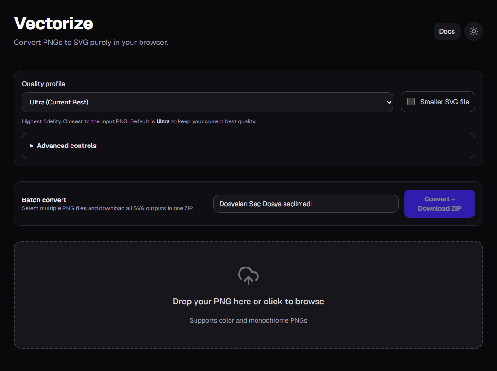

# PNG to SVG Converter

Browser-based PNG to SVG converter built with Next.js. The app runs client-side conversion with quality presets, advanced tracing controls, similarity scoring, and batch ZIP export.

## Screenshot



## Features

- Single PNG to SVG conversion in-browser
- Quality profiles: `Ultra`, `Balanced`, `Fast`, `Pixel Art`
- Advanced controls for trace fine-tuning
- Similarity score (PNG vs generated SVG pixel comparison)
- Batch conversion to ZIP
- Light/dark theme support

## What Is Actually Required?

If you are deciding what to keep in production, use this matrix:

- `Quality profile` -> required for most users; keeps UI simple and predictable
- `Advanced controls` -> required only for power users; should stay optional/expert-only
- `Batch convert` -> required when users process many assets; optional for single-file workflows

## Tech Stack

- Next.js 16 (App Router)
- React 19 + TypeScript
- Tailwind CSS 4
- `imagetracerjs` for vectorization
- Web Worker for similarity scoring
- Vitest + Testing Library for tests

## Local Development

Install dependencies and run the app:

```bash
npm install
npm run dev
```

Open `http://localhost:3000`.

## Quality and Build Commands

```bash
npm run lint
npm run test:run
npm run build
```

Recommended pre-release gate:

1. `npm run lint`
2. `npm run test:run`
3. `npm run build`

## Usage Guide

### 1) Single File Conversion

1. Upload a PNG file.
2. Select a quality profile.
3. Optionally enable advanced controls.
4. Review preview and similarity score.
5. Download SVG.

### 2) Choosing Quality Profile

- `Ultra`: best visual fidelity, larger file, slower
- `Balanced`: default production choice for most assets
- `Fast`: quickest output, reduced detail
- `Pixel Art`: preserves hard edges for sprite/pixel assets

### 3) Advanced Controls (Expert)

Use only when preset output is not enough. Adjust one parameter at a time:

- `numberofcolors`: palette depth, quality vs file size
- `ltres` / `qtres`: line/curve error thresholds
- `pathomit`: remove tiny paths for cleaner/smaller output
- `roundcoords`: coordinate precision
- `colorquantcycles`, `blurradius`, `blurdelta`: color smoothing behavior

## Batch Convert: When It Is Worth It

Batch mode is recommended when:

- You convert many files with the same settings
- You need consistent output profile across assets

Batch mode is not necessary when:

- You only process one or two files occasionally

## Security and Validation Notes

- PNG input is validated by extension, MIME type, and PNG signature.
- Rendered SVG is sanitized before preview to reduce script/event payload risks.
- App runs conversion locally in browser; no server upload pipeline is required.

## Testing

Current tests cover:

- PNG file validation
- SVG sanitization
- Dropzone file selection behavior
- Download button trigger flow

Run all tests:

```bash
npm run test:run
```

## Known Limitations

- Similarity score is a heuristic, not a perceptual truth metric.
- Very large batches may increase memory usage depending on browser limits.
- Certain SVG decode operations can fail in workers on some browsers; fallback path is used.

## Project Structure

- `app/page.tsx`: main app UI and flows
- `app/docs/page.tsx`: in-app documentation page
- `lib/tracer.ts`: trace configuration and conversion orchestration
- `lib/fileValidation.ts`: strict PNG validation
- `lib/sanitizeSvg.ts`: SVG sanitization
- `workers/similarity.worker.ts`: background similarity scoring
- `components/*`: UI components

## Release Checklist

1. Validate presets with sample assets (photo, logo, pixel-art).
2. Confirm single and batch conversion paths.
3. Run lint/tests/build.
4. Review docs after behavior changes.
